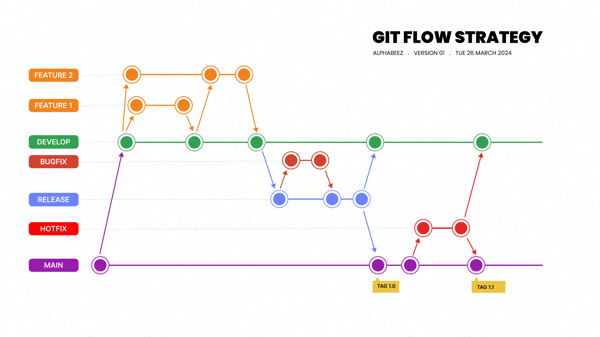

# Note Diary Web Application

The Note Web Project is a web application built entirely with vanilla JavaScript, HTML, and CSS. It allows users to create, read, update, and delete notes. The project focuses on providing a simple yet effective interface for managing personal notes.

Key Features :
- Create Note: Users can add new notes with a title, date, and description.
- Read Note: Display a list of all notes with options to view details.
- Update Note: Modify the content of existing notes.
- Delete Note: Remove notes that are no longer needed.

> Diary-Web <a href="index.html">Click Here</a>.

This project is 
## Description
The Note Diary Web Application is a simple and intuitive tool for creating, editing, and managing personal notes. Users can add, view, and delete notes seamlessly.

## Table of Contents
- [Installation](#installation)
- [Usage](#usage)
- [Folder Structure](#folder-structure)
- [Acknowledgments](#acknowledgments)
- [Contact](#contact)

## Installation

### Prerequisites
- A text editor or Integrated Development Environment (IDE) for viewing the project:
        - [Visual Studio Code](https://code.visualstudio.com/)
- A modern web browser (e.g., Chrome, Firefox)

### Steps
1. Clone the repository:
    ```bash
    git clone https://git.clp.kr/anbschool/2nd/alphabeez/khom-khit/diary-web-project.git
    ```
2. Navigate to the project directory:
    ```bash
    cd note-diary-web
    ```

## Usage

### Running the Project
To start the development server, run:
```bash
npm start

## Folder Structure
note-diary-web/
│
├── assets/            # Images and other assets
│   ├── images/        # Website images
│   │   └── pic-1.png  # Example image
│   └── logo/          # Website logos (hamburger, info, etc.)
│       ├── hamburger-logo.png
│       ├── info-logo.png
│       └── logo.png
│
├── styles/                # CSS files
│   ├── components-style/  # Styles for reusable components
│   │   ├── button.css
│   │   ├── footer.css
│   │   ├── form.css
│   │   ├── header.css
│   │   ├── modal.css
│   │   ├── note.css
│   │   ├── side-bar.css
│   │   └── textnav.css
│   └── pages-style/       # Styles for specific webpages
│       ├── create.css     # Styles for create note page
│       ├── edit.css       # Styles for edit note page (not mentioned before)
│       ├── list.css       # Styles for list notes page
│       └── view-and-del.css  # Styles for view and delete note page (not mentioned before)
│
├── scripts/               # JavaScript files
│   ├── components/        # JS for reusable components
│   │   ├── footer.js
│   │   ├── header.js
│   │   ├── noteManager.js  # Note management logic
│   │   ├── sidebar.js     # Sidebar functionality
│   │   └── uiManager.js   # UI management functions
│   ├── pages-js/          # JS specific to webpages
│   │   ├── create.js      # JS functionalities for create page
│   │   ├── edit.js        # JS functionalities for edit page (not mentioned before)
│   │   ├── index.js       # JS functionalities for main page (not mentioned before)
│   │   └── list.js        # JS functionalities for list page
│   └── script.js          # Common JS functionalities used across pages
│
├── index.html             # Home page
└── README.md              # Project README file

## Pages Included

| Page Names |
|------------|
| <a href="">Home</a>        |
| <a href="">List</a>       |
| <a href="">Create</a>         |
| <a href="">View & Delete</a>         |
| <a href="">Edit</a>       |


### Features
Features
a. Create Notes
    1. Go to the "Create Note" page.
    2. Fill in the note title, date, and description in the form.
    3. Click the "Add Note" button to save the note.
b. View Notes
    1. Navigate to the home page to see a list of all notes.
    2. Click on a note to view its details.
c. Edit Notes
    1. In the list of notes, click the "Edit" button next to the note you want to edit.
    2. Update the title, date, and description in the form.
    3. Click "Save Changes" to update the note.
d. Delete Notes
    1. In the list of notes, click the "Delete" button next to the note you want to remove.
    2. Confirm the deletion in the popup modal.


## Technology Used
| **Technologies** | **Purpose** |
|------------------|------------------|
| HTML             | Structure and Create content for the pages |
| CSS              | Styling HTML elements and layout |
| JavaScript       | Use to make the website behaviour |

## Git Strategy & Scenario



Implementation:


Feature Branches:


Feature 1: Create a feature branch to implement Pound to Kg conversion.
Feature 2: Implement Fahrenheit to Celsius conversion.
Feature 3: Develop Mile to Kilometer conversion.


Release Branch:


Prepare the codebase for release, ensuring all features are thoroughly tested and stable.
Tag the release with the version number (e.g., 1.0).


Bug fix Branch:


Create a bug fix branch to address any identified issues, such as adding missing headings.


Hotfix Branch:


If a critical issue arises post-release (e.g., grammatical errors), immediately create a hotfix branch for resolution.

—--

Feature Branch:


1. Create Branch: Use the command git flow feature start <feature_name>.
2. Track branch : git flow feature track <feature_name>.
3. Publish Branch: Use the command git flow feature publish <feature_name>.
4. Merge/Rebase: After completing the feature, merge or rebase it with the develop branch.
5. Finish Branch: Use the command git flow feature finish <feature_name>.


Release Branch:


1. Create Branch: Use the command git flow release start <version_number>.
2. Track branch : Use command git flow release track <version_number>.
3. Publish Branch: Use the command git flow release publish <version_number>.
4. Merge/Rebase: Merge or rebase the release branch with the main and develop branches.
5. Finish Branch: Use the command git flow release finish <version_number>.


Bug fix Branch:


1. Create Branch: Use the command git flow bugfix start <bug_name>.
2. Publish Branch: Use the command git flow bugfix publish <bug_name>.
3. Merge/Rebase: After fixing the bug, merge or rebase the branch with the develop branch.
4. Finish Branch: Use the command git flow bugfix finish <bug_name>.


Hotfix Branch:


1. Create Branch: Use the command git flow hotfix start <version_number>.
2. Track branch : Use the command git flow hotfix  track <version_number>
3. Publish Branch: Hotfix branches are typically urgent fixes and may not be published.
4. Merge/Rebase: Merge or rebase the hotfix branch with the main and develop branches.
5. Finish Branch: Use the command git flow hotfix finish <version_number>.

## Acknowledgement 

Thanks to team Alphabeez members for helping to give feedbacks and review code for this Project.

